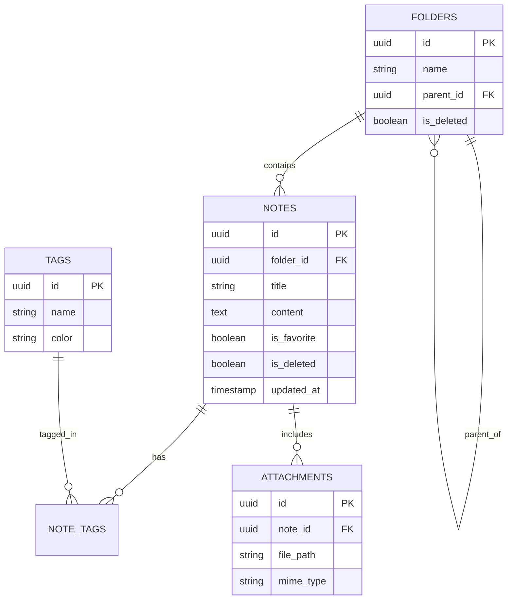

# Watermelon Storage Architecture

## 1. Overview
Watermelon uses a **local-first** storage approach.
*   **Database**: SQLite (via `rusqlite` or `sqlx`).
*   **Assets**: Local file system for images/attachments.
*   **Sync**: Designed for eventual consistency (CRDT-friendly schema).

## 2. Database Schema (SQLite)

We use **UUIDs (v4)** for primary keys to ensure global uniqueness for syncing.
Timestamps are stored as **ISO 8601 strings** (UTC) or Unix integers (milliseconds).

### Tables

#### `folders`
Organizes notes into collections.
```sql
CREATE TABLE folders (
    id TEXT PRIMARY KEY,          -- UUID
    name TEXT NOT NULL,
    parent_id TEXT,               -- For nested folders (Self-referential)
    is_system_folder BOOLEAN DEFAULT 0, -- e.g., "Trash", "Favorites"
    created_at INTEGER NOT NULL,
    updated_at INTEGER NOT NULL,
    is_deleted BOOLEAN DEFAULT 0  -- Soft delete
);
```

#### `notes`
The core content.
```sql
CREATE TABLE notes (
    id TEXT PRIMARY KEY,          -- UUID
    folder_id TEXT,               -- FK to folders
    title TEXT NOT NULL,
    content_raw TEXT,             -- The raw content (e.g., Markdown or HTML)
    content_preview TEXT,         -- Plain text snippet for the list view
    is_pinned BOOLEAN DEFAULT 0,
    is_favorite BOOLEAN DEFAULT 0,
    created_at INTEGER NOT NULL,
    updated_at INTEGER NOT NULL,
    is_deleted BOOLEAN DEFAULT 0, -- Soft delete (Trash)
    FOREIGN KEY(folder_id) REFERENCES folders(id)
);
```

#### `tags`
Many-to-many categorization.
```sql
CREATE TABLE tags (
    id TEXT PRIMARY KEY,
    name TEXT NOT NULL UNIQUE,
    color TEXT,                   -- Hex code (e.g., #2E8B57)
    created_at INTEGER NOT NULL
);
```

#### `note_tags`
Junction table for notes and tags.
```sql
CREATE TABLE note_tags (
    note_id TEXT NOT NULL,
    tag_id TEXT NOT NULL,
    PRIMARY KEY (note_id, tag_id),
    FOREIGN KEY(note_id) REFERENCES notes(id),
    FOREIGN KEY(tag_id) REFERENCES tags(id)
);
```

#### `attachments`
Metadata for files stored on disk.
```sql
CREATE TABLE attachments (
    id TEXT PRIMARY KEY,
    note_id TEXT NOT NULL,
    file_name TEXT NOT NULL,      -- Original filename
    file_path TEXT NOT NULL,      -- Relative path in storage (e.g., "assets/uuid.png")
    mime_type TEXT,
    size_bytes INTEGER,
    created_at INTEGER NOT NULL,
    FOREIGN KEY(note_id) REFERENCES notes(id)
);
```

#### `settings`
Key-value store for app preferences.
```sql
CREATE TABLE settings (
    key TEXT PRIMARY KEY,
    value TEXT,
    updated_at INTEGER NOT NULL
);
```

## 3. ER Diagram



## 4. File Storage Structure

Data will be stored in the standard XDG data directory for Linux:
`~/.local/share/watermelon/`

```
~/.local/share/watermelon/
├── watermelon.db          # Main SQLite database
├── watermelon.db-wal      # Write-Ahead Log (for performance)
└── attachments/           # Folder for user assets
    ├── 550e8400-e29b....png
    ├── 7d34a511-b12c....pdf
    └── ...
```

**Handling Attachments:**
1.  User drags image into editor.
2.  App generates a UUID for the file.
3.  File is copied to `~/.local/share/watermelon/attachments/<UUID>.<ext>`.
4.  Record inserted into `attachments` table.
5.  Reference inserted into Note content (e.g., ``).

## 5. JSON Import/Export Format

For interoperability, we define a standard JSON schema.

```json
{
  "version": 1,
  "exported_at": 1678886400,
  "folders": [
    {
      "id": "uuid-1",
      "name": "Personal",
      "parent_id": null
    }
  ],
  "notes": [
    {
      "id": "uuid-2",
      "folder_id": "uuid-1",
      "title": "My First Note",
      "content": "Hello world...",
      "tags": ["ideas", "todo"],
      "created_at": 1678886400,
      "updated_at": 1678886500,
      "attachments": [
        {
          "id": "uuid-3",
          "file_name": "image.png",
          "data_base64": "..." // Optional: Inline data for single-file export
        }
      ]
    }
  ]
}
```

## 6. Encryption Model (Optional)

**Strategy**: Application-Level Encryption (Column-based).
Instead of encrypting the entire DB (which makes opening it in external tools hard), we can encrypt sensitive columns (`title`, `content_raw`, `content_preview`) using **ChaCha20-Poly1305**.

*   **Key Management**:
    *   User sets a "Master Password".
    *   Key is derived using Argon2id.
    *   Key is stored in the system keyring (Secret Service API on Linux).
*   **Implementation**:
    *   If encryption is enabled, `content_raw` stores the ciphertext (Base64).
    *   Search index would require a separate FTS (Full Text Search) virtual table that might need to be kept unencrypted *or* we accept no search on encrypted notes without unlocking.

## 7. Sync-Ready Design

To support future syncing (e.g., to a cloud server or peer-to-peer):
1.  **Immutable IDs**: UUIDs never change.
2.  **Soft Deletes**: `is_deleted` flag instead of `DELETE FROM`. This allows the sync engine to propagate deletions.
3.  **Last Write Wins (LWW)**: `updated_at` timestamp allows simple conflict resolution (latest change overwrites).
4.  **Merkle Tree / Vector Clocks** (Future): For more robust syncing, we can add a `version` integer to every row.
