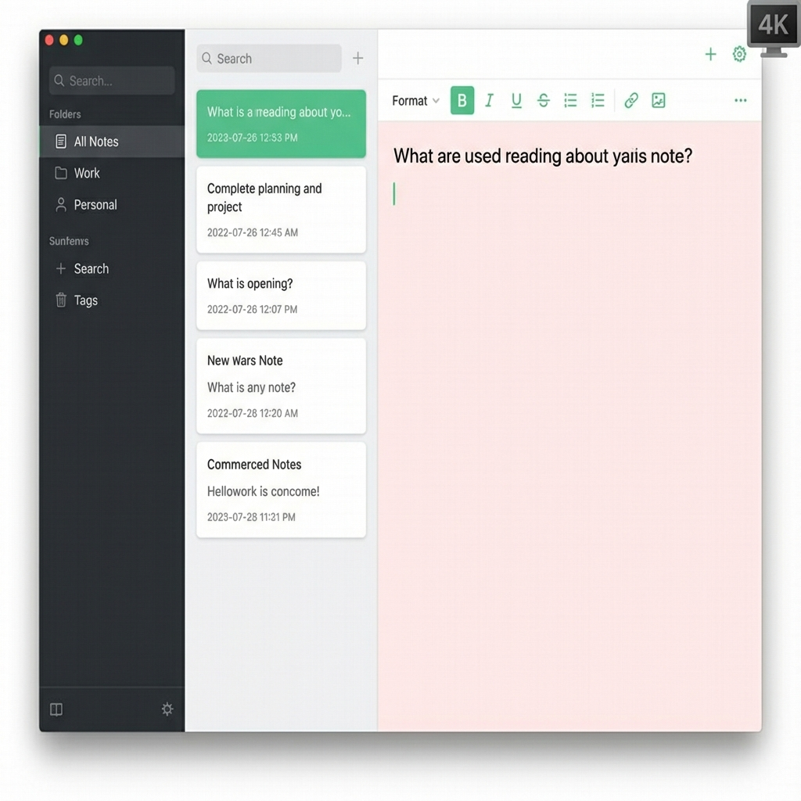

# Watermelon UI/UX Blueprint

## 1. Design Philosophy: "The Watermelon Aesthetic"

The Watermelon design language is defined by **freshness**, **contrast**, and **organic minimalism**.

### Color Palette
*   **Rind (Primary Accent)**: `#2E8B57` (Sea Green) - Used for active states, primary buttons, and selection highlights.
*   **Flesh (Background/Surface)**: 
    *   *Light Mode*: `#FFF0F0` (Very Pale Blush) - The main editor background, mimicking the inside of a watermelon.
    *   *Dark Mode*: `#1A1A1A` (Dark Grey/Black) - Deep contrast, like the seeds or the dark stripes.
*   **Seeds (Icons/Text)**: 
    *   *Light Mode*: `#2C3E50` (Dark Slate) - High contrast text.
    *   *Dark Mode*: `#FFFFFF` (White) - Text on dark background.
*   **Sidebar**:
    *   *Light Mode*: `#F8F9FA` (Off-white/Grey) - Distinct from the editor.
    *   *Dark Mode*: `#121212` (Darker Grey) - Subtle separation.

### Typography
*   **Font Family**: `Inter` or `Cantarell` (System Default).
*   **Headings**: Bold, tight tracking.
*   **Body**: Regular weight, 1.6 line height for readability.
*   **Monospace**: `JetBrains Mono` or `Fira Code` for code blocks.

### Spacing & Layout
*   **Grid**: 8px baseline grid.
*   **Padding**: Generous padding (e.g., `24px` or `32px`) in the editor to avoid a cramped feel.
*   **Margins**: Content is centered with max-width for readability on large screens.
*   **Corners**: `12px` radius on cards and buttons (Soft, organic feel).

## 2. Wireframes & Views

### A. Home View (Three-Pane Layout)
1.  **Sidebar (Left)**:
    *   "All Notes", "Favorites", "Trash".
    *   Folders/Categories list (with "Seed" icons).
    *   Bottom: Settings gear icon.
2.  **Note List (Middle)**:
    *   Search bar at the top ("Search your slice...").
    *   List of note cards showing Title, Date, and a 2-line preview.
    *   Active note highlighted with a **Rind Green** border or background.
3.  **Editor (Right)**:
    *   Title input (Large, H1).
    *   Date/Time metadata (Subtle).
    *   Rich text content area.

### B. Note Editor
*   **Toolbar**: Floating or fixed at top. Minimal icons (Bold, Italic, List).
*   **Focus Mode**: Option to collapse sidebar and note list for distraction-free writing.
*   **Empty State**: A friendly watermelon slice illustration saying "Plant a new idea...".

### C. Settings
*   **Appearance**: Toggle Light/Dark/System. Theme selector (Watermelon, Honeydew, Cantaloupe).
*   **Editor**: Font size, Line height, Spell check toggle.
*   **Data**: Export notes, Backup location.

## 3. UI Components

| Component | Description | Visual Style |
| :--- | :--- | :--- |
| **Action Button** | Primary actions (New Note) | Pill-shaped, Rind Green background, White text. |
| **Note Card** | Item in the note list | White/Dark Grey card, subtle shadow, rounded corners. |
| **Search Bar** | Global search | Rounded rectangle, internal icon, "Rind" border on focus. |
| **Tags** | Categorization labels | Small pill badges, pastel background colors. |
| **Toggle** | Settings switches | iOS-style toggle, Green when active. |

## 4. Animations & Transitions (The "Juice")

To achieve **Apple-level smoothness**, we will use GTK4's animation capabilities:

*   **Navigation**:
    *   *Sidebar Slide*: Smooth ease-in-out when toggling the sidebar.
    *   *List to Detail*: When clicking a note, the editor content should fade in slightly or slide up (5-10px).
*   **Interactions**:
    *   *Hover*: Buttons and list items should have a quick (150ms) background fade or scale (1.02x) effect.
    *   *Click*: Subtle "press" effect (0.98x scale).
*   **Typing**:
    *   Cursor movement should be smooth (if supported by the text view).
    *   Auto-save indicator: A small spinning seed or checkmark that fades in/out.

## 5. Visual Mockups

